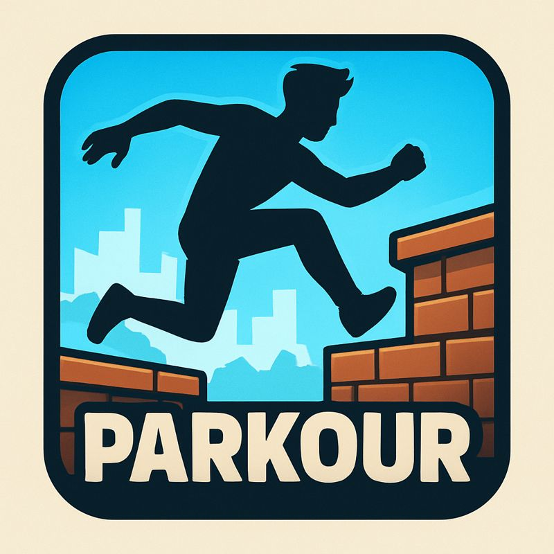

  

# Parkour 3D

A browser-based 3D parkour game with wall-running, sliding, and precision platforming.

## Play

Open `index.html` in a browser or visit the GitHub Pages deployment.

## Controls

| Key | Action |
|-----|--------|
| WASD | Move |
| Mouse | Look around |
| Space | Jump |
| E | Slide (while moving) |

Run along walls to wall-run.

## Features

- Multiple levels with increasing difficulty
- Wall-running mechanics
- Sliding through tunnels
- Speed tracking
- AI opponent to race against

## License

MIT
